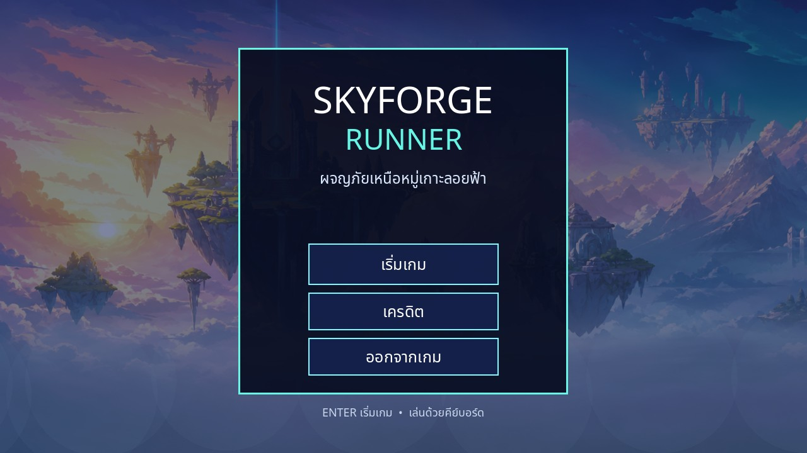
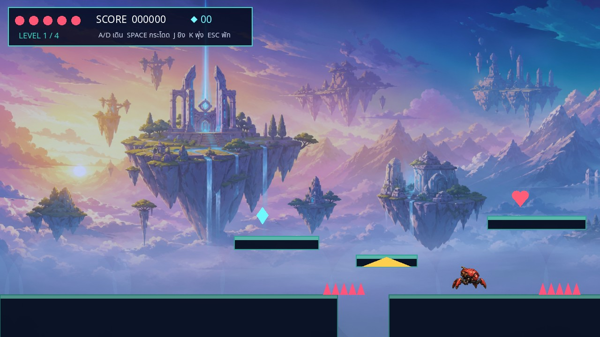

# Skyforge Runner — GameLab 4

เกม 2D Platform Side-Scrolling สำหรับแบบฝึกหัดที่ 4 วิชา Computer Game Development สร้างด้วย Godot 4.7

## จุดเด่น

- 4 ด่านธีมหมู่เกาะลอยฟ้า พร้อมฉากหลัง Parallax ที่สร้างด้วย OpenAI ImageGen
- ตัวละครมี HP, คะแนน, ยิงกระสุน, Dash และเหยียบศัตรูได้
- ศัตรู 3 แบบ: Crawler, Hopper และ Drone พร้อมระบบเกิดใหม่และเอฟเฟกต์อนุภาค
- กับดักหนาม, Moving Platform, Jump Pad และ Portal
- ไอเท็มหัวใจ, เพิ่มความเร็ว, เพิ่มพลังกระโดด และคริสตัล
- เมนูหลัก, เครดิต, Pause, Game Over, Win Game และเสียงดนตรี/เอฟเฟกต์สังเคราะห์

## Game Story

นครลอยฟ้า Skyforge ถูกกองทัพจักรกลเข้ายึดครองและตัดพลังงานของประตูโบราณ ผู้เล่นรับบทเป็นนักวิ่งแห่งฟากฟ้า ออกเดินทางผ่านเกาะทั้งสี่เพื่อรวบรวมคริสตัลพลังงาน ต่อสู้กับ Crawler, Crystal Hopper และ Drone หลบกับดัก และเปิดประตู Skyforge ก่อนนครทั้งหมดจะตกลงสู่ห้วงเมฆ

## วิธีเล่น

- `A/D` หรือ `←/→` เดิน
- `Space`, `W` หรือ `↑` กระโดด
- `J` หรือ `F` ยิง Energy Bolt
- `K` หรือ `Shift` พุ่งตัว
- `Esc` หยุดเกม/กลับ

เปิด `project.godot` ใน Godot 4.7 แล้วกด F6/F5 เพื่อเล่น หรือเล่น Web Export จาก `docs/index.html` หลังติดตั้ง Export Templates และสั่ง Export

## ผู้จัดทำ

รหัสนักศึกษา: **673380079-5**  
ชื่อ–นามสกุล: **นายปัณณวัชร์ เชเดช**  
GitHub: <https://github.com/pannawatc-bot/gamelab>

## Demo และลิงก์ส่งงาน

- Demo Video: เพิ่มลิงก์ YouTube หรือ Google Drive ที่นี่หลังอัปโหลด
- Play Game: <https://pannawatc-bot.github.io/gamelab/>
- Project Repository: <https://github.com/pannawatc-bot/gamelab>

## เครดิตภาพ

ฉากหลัง `assets/skyforge_background.png` สร้างด้วย OpenAI ImageGen สำหรับโปรเจกต์นี้โดยเฉพาะ ภาพตัวละคร ไอเท็ม และเอฟเฟกต์ที่เหลือวาดแบบ Procedural ด้วย GDScript

Sprite Atlas `assets/sprites/skyforge_atlas.png` สร้างด้วย OpenAI ImageGen และลบพื้นหลังแบบ chroma key สำหรับใช้ใน AnimatedSprite2D ฟอนต์ภาษาไทยใช้ Noto Sans Thai ภายใต้ SIL Open Font License 1.1 โดยเก็บใบอนุญาตไว้ที่ `assets/fonts/OFL-NotoSansThai.txt`
